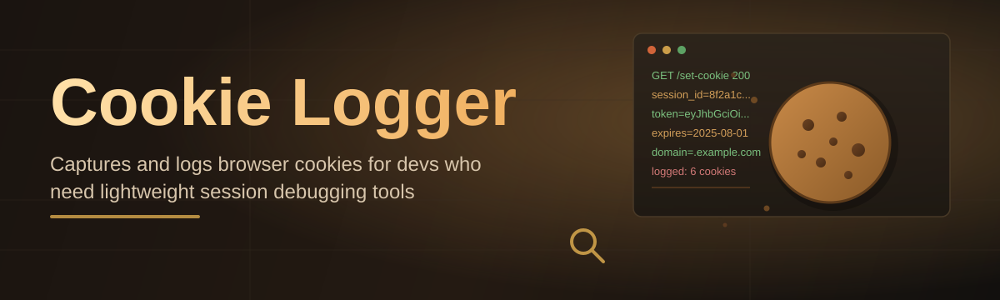
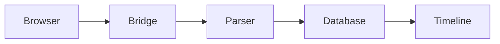

# cookie-log-manager 🍪📋

  

*A tiny desktop companion that watches, records, and organizes browser cookie activity — so you never lose track of a session again.*

## 🎬 Overview

**cookie-log-manager** started as a weekend itch. I kept losing session state across browser restarts, extension updates, and profile switches — and every "cookie viewer" I tried was either bloated, ad-ridden, or built for a completely different job. So I built the tool I actually wanted: a lightweight, standalone Windows app that logs cookie activity in real time, timestamps every change, and lets you replay or export that history whenever you need it.

This is a **passion project**, not a corporate roadmap. Every feature exists because I personally hit a wall and decided to fix it. That means the codebase stays small, the UI stays honest, and nothing phones home unless you explicitly tell it to. If you're a developer debugging session persistence, a QA tester chasing intermittent auth bugs, or just a curious tinkerer who wants to *see* what's happening under the hood of your browser — this is for you.

The name says it plainly: it's a **log manager for cookies**. Not a scraper, not a modifier tool, not anything shady — just clean, structured, timestamped visibility into cookie lifecycle events, wrapped in an interface that respects your time.

  

> [!NOTE]
> The download button always points to the official landing page. No mirrors, no third-party hosts — just the source.

---

## 🧠 What It Actually Does

- **Live capture engine** — watches cookie writes, updates, and expirations as they happen, streaming them into a readable timeline instead of a dumped JSON blob.

- **Session snapshots** — freeze the exact cookie state at any moment and compare it against a later snapshot, side by side, diff-style.

- **Smart filtering** — slice logs by domain, session ID, expiry window, or secure/HTTP-only flags without writing a single query.

- **Local-first storage** — every log lives in a local SQLite-backed file on your machine. Nothing leaves your device unless *you* export it.

- **Export pipeline** — dump filtered logs to CSV or JSON in one click, ready for a spreadsheet, a bug report, or a debugging session with a teammate.

- **Tag & annotate** — attach notes to specific log entries so future-you remembers *why* that cookie mattered.

- **Multi-profile awareness** — tracks activity per browser profile, so testing across five accounts doesn't turn into a single tangled mess.

- **Search-as-you-type** — a fast in-memory index means searching thousands of entries feels instant, not laggy.

> [!TIP]
> Pin the **filter bar** to the top of the window (Settings → Layout) if you're constantly narrowing by domain — it saves a surprising number of clicks over a long session.

---

## 🚀 Getting Started

1. **Visit the landing page.** Click the download button above — it's the only official source.

2. **Download the installer.** No archives to unzip, no dependency chasing — just one executable.

3. **Run it.** Windows may show a SmartScreen prompt for new tools; click "More info → Run anyway."

4. **Point it at your browser.** The onboarding wizard walks you through enabling the logging bridge — takes under a minute.

> [!IMPORTANT]
> On first launch, Windows Defender or your antivirus may flag the app simply because it's new and unsigned by a major publisher. This is normal for small indie tools — check the SHA256 hash on the landing page if you want to verify integrity yourself.

---

## 🖥️ System Requirements

| Requirement | Details |
|---|---|
| **OS** | Windows 10 (64-bit) or Windows 11 |
| **Dependencies** | None — fully standalone, no runtime installs |
| **Disk space** | ~45 MB installed |
| **RAM** | 150 MB typical, under 300 MB during heavy logging |
| **Browser support** | Chromium-based and Firefox-based browsers |
| **Internet** | Not required after download |

  

---

## ⚙️ How It Works

**cookie-log-manager** runs a small local bridge process alongside your browser. It doesn't inject anything into pages — it simply listens to cookie store events exposed by the browser's own debugging protocol, then structures what it hears.

1. **Bridge connects** to the browser's local debugging endpoint.
2. **Event stream** of cookie writes/updates/expirations flows in.
3. **Parser normalizes** each event into a structured log entry.
4. **Local database** stores entries with timestamps and metadata.
5. **UI renders** the timeline, ready for filtering, tagging, and export.

---

## 🔧 Troubleshooting

<strong>The bridge won't connect to my browser.</strong>

Make sure your browser was launched *after* cookie-log-manager, and that no other debugging tool is already attached to the same port. Restart both if unsure.

<strong>Logs stopped updating mid-session.</strong>

This usually happens after a browser update mid-run. Reconnect the bridge from the toolbar — no restart of the app needed.

<strong>Export file is empty despite visible logs.</strong>

Check your active filter — exports respect whatever filter is currently applied. Clear filters before exporting the full log.

<strong>Windows flagged the installer.</strong>

Expected for small unsigned tools. Verify the hash listed on the landing page, then allow it through SmartScreen.

<strong>Can I run it on macOS or Linux?</strong>

Not currently — this build targets Windows 10/11 only. Cross-platform support is a discussed, not promised, future direction.

---

## 🎨 UI, UX & Shortcuts

Themes: **Midnight**, **Paper**, and **High Contrast** — switch instantly from Settings → Appearance, no restart required.

Settings persist locally, per-user, so multiple Windows accounts on the same machine keep independent preferences.

| Shortcut | Action |
|---|---|
| `Ctrl + N` | Start a new logging session |
| `Ctrl + S` | Save current snapshot |
| `Ctrl + F` | Focus the search bar |
| `Ctrl + E` | Export filtered logs |
| `Ctrl + Shift + C` | Clear all active filters |
| `Ctrl + T` | Toggle theme |
| `Ctrl + ,` | Open Settings |
| `F5` | Refresh live capture view |
| `Ctrl + Q` | Quit application |

> [!TIP]
> Hold `Shift` while clicking a log entry to select a range — great for bulk tagging or exporting a specific slice of a session.

---

## 🤝 Contributing & Community

This project grew from a solo itch-scratch into something people actually rely on — and that only happens with community input.

- **Bug reports** — open an issue with steps to reproduce; screenshots help enormously.
- **Feature ideas** — discussions are open; not every idea ships, but every idea gets read.
- **Pull requests** — small, focused PRs merge fastest. Big rewrites need a discussion first.

> [!WARNING]
> Please don't submit PRs that add tracking, telemetry, or remote calls without an explicit opt-in toggle. Local-first is a core principle here, not a marketing line.

---

## 📜 License

Released under the [MIT License](LICENSE), 2026.

Use it, fork it, build on it — just keep the license notice intact.

---

## ⚠️ Disclaimer

**cookie-log-manager** is a personal, independently maintained project provided as-is, with no warranty of any kind. It is intended for legitimate debugging, testing, and personal session management purposes only. You are responsible for complying with the terms of service of any browser or website you use it alongside.

  

